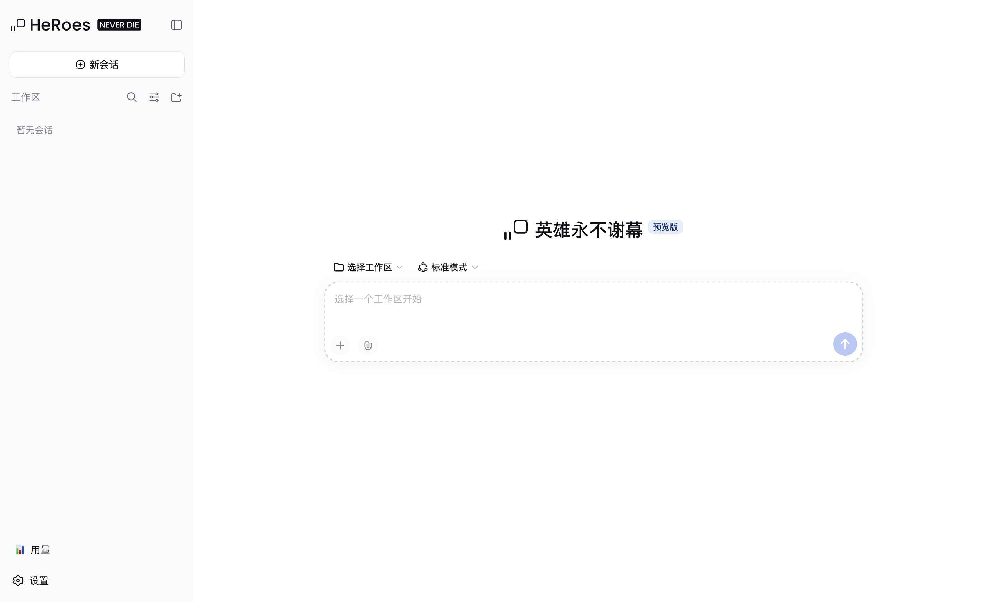
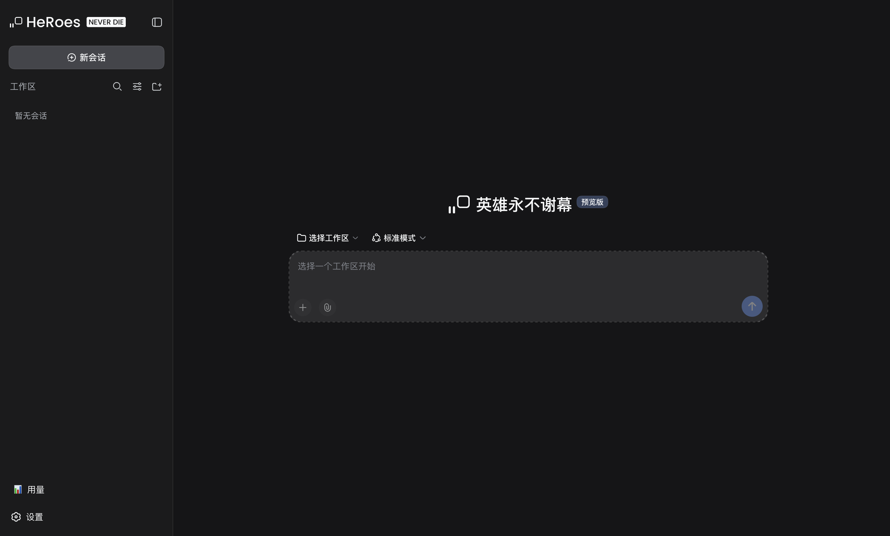
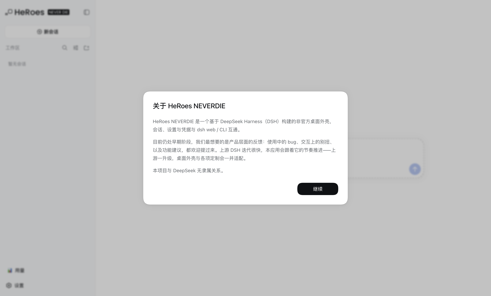

# HeRoes NEVERDIE

> **非官方项目。** 本项目是一个基于 [DeepSeek Harness](https://github.com/deepseek-ai/deepseek-harness)（DSH）构建的 **第三方 Electron 桌面外壳**，与 DeepSeek 无隶属、合作或授权关系。"DeepSeek"、"DeepSeek Harness" 是其各自所有者的商标，本仓库仅作描述性使用。
>
> **Unofficial.** This is a community-built Electron desktop surface for DeepSeek Harness (DSH). It is not affiliated with, sponsored by, or endorsed by DeepSeek.

---

## What is this?

**HeRoes NEVERDIE** is an unofficial Electron desktop shell for
[DeepSeek Harness](https://github.com/deepseek-ai/deepseek-harness) (DSH). It takes the architecture
upstream reserved for Electron — the `desktop` profile, a `file://` frontend, and an IPC bridge
instead of an HTTP server — and adds a small set of self-authored customizations:

| | |
|---|---|
| `brand` | HeRoes mark and wordmark in the sidebar, plus the home-screen hero mark |
| `usage-panel` | account balance beside a locally recomputed token ledger |
| `pinned` | pin/hold marks on conversation content, stored per session |
| `process-fold` | a finished turn's process rows fold into a drawer |

<p align="center">
  
</p>

<details>
<summary>More screenshots</summary>

| Dark theme | First-run notice |
|:---:|:---:|
|  |  |

</details>

Sessions, settings and credentials are shared with `dsh web` and the CLI through `~/.dsh`, so all
data — conversation history, settings, keys, attachments — stays on your own machine. There is no
server component.

```sh
git clone https://github.com/bergert131965/heroes-neverdie.git
cd heroes-neverdie
npm ci && npm run patch && npm start
```

Requires **macOS** and **Node.js ≥ 22**. `npm ci` overwrites `node_modules`, which is where both
patches live, so `npm run patch` is not optional. `npm run verify` only checks that they are in
place, and fails if they are not.

If terminal or command execution misbehaves after install, run `npm run rebuild` and read the real
error — the `postinstall` hook swallows a failed `node-pty` rebuild.

Planned work — and, just as usefully, what is explicitly **out of scope** — is in
[docs/roadmap.md](docs/roadmap.md).

---

<details>
<summary><b>以下为中文文档</b></summary>

按照官方预留的桌面端架构实现：**desktop profile + `file://` 加载 + IPC 桥**，功能对齐网页版（`dsh web`）。

---

## 相对上游的主要改动

一句话：**上游提供 agent 与前端，本仓库提供"把它装进一个 macOS 原生窗口"这一层，外加四处自有改动。**

| # | 改动 | 位置 | 说明 |
|---|---|---|---|
| 1 | **桌面载体** | `main.js`、`preload.js`、`profile/plugins/desktop-*.js` | 用官方预留的 `desktop` profile + `file://` 前端 + IPC 桥替代 HTTP 服务器，**不监听任何端口** |
| 2 | **三个客户端插件** | `profile/plugins/{brand,usage-panel,pinned}/` | 品牌槽位接管（含首页 hero）、用量与余额账本、会话置顶 |
| 3 | **两个上游 bundle 补丁** | `scripts/patch-*.mjs` | 过程行折叠、品牌文案与窗口标题——上游写死、槽位机制覆盖不到的部分 |
| 4 | **macOS 打包** | `scripts/package-macos.mjs` | 含一个"全程零删除"的手写打包器，适配拒绝 unlink/rename 的宿主 |
| 5 | **品牌与合规改造** | `docs/brand.md` | 按上游 BRAND_GUIDELINES 完成改名，并明确哪些属于描述性引用、应当保留 |

> 功能对照与截图见上方 **What is this?**；后续计划见 [docs/roadmap.md](docs/roadmap.md)；各文件的用途见下方目录结构。

## 架构

官方在 `@deepseek-ai/dsh` 中为 Electron 预留了三条主线，本应用是它们的组合：

| 官方预留 | 本应用实现 |
|---|---|
| `desktop` 是 Electron 专属 profile，CLI 拒绝 boot/config-dump/plugin 管理 | `main.js` 通过 `loadProfileDirectory()` 加载应用自有的 `profile/` 目录（bundles 与 `dsh web` 相同：`dsh-base` + `dsh-web-app`），完全绕开 CLI 的 profile 查找 |
| "Electron loads dist over `file://` and carries fetch over an IPC bridge" | 启动时把 `dsh-web-frontend` 的 dist 复制到 userData，用 `renderIndexInjections()` + `bootInjections()` 渲染出含 `window.__DSH_BOOT__` 的 index.html，经 `loadFile()` 以 `file://` 加载；页面里不跑 HTTP 服务器 |
| 客户端读取 `globalThis.__DSH_TRANSPORT__` 与 `__DSH_FILE_UPLOAD__` 官方扩展点 | `profile/plugins/desktop-runtime.js` 提供 `desktopShell` 服务；preload + 页面前置脚本实现 fetch / 流式上传 / 逻辑流三种 IPC 载体 |

传输路径（与网页版一一对应）：

- **Remote 一元调用**：渲染进程 fetch → IPC → `ctx.connection.createSharedFetchHandler('/api').fetch(request)` → Typert Gateway（与网页版 `/api` 完全相同的处理链）
- **Remote 逻辑流**（会话事件流 `$events`、流式 Remote 方法）：`openStream` → IPC → `ctx.typertGateway.wireStream.open()`
- **插件 bundle**：`/plugins/??…` 重写为 `dsh://harness/plugins/??…` 自定义协议 → `ctx.clientModules.fetchBundle()`
- **文件上传**：`__DSH_FILE_UPLOAD__` 钩子 → 同一 IPC fetch 载体（支持 ReadableStream 请求体分块）

桌面 profile 补丁（`profile/cordis.patch.yml`）禁用 web 专属的四行（`webserver`、`web-startup`、`web-runtime`、`client-hmr`），插入两行桌面行（`desktop-startup`、`desktop-runtime`），并补上 `connection` 行注入的 `webRuntime` 服务。**其余全部继承 `dsh-web-app` 补丁**，因此功能对齐是结构性的，而不是复刻。

### 本仓库自有的定制

除了桌面外壳本体，本仓库还包含三个自写的客户端插件（`profile/plugins/`）：

| 插件 | 作用 |
|---|---|
| `brand` | 接管三个品牌槽位：侧栏标记与字标、**首页中央 hero 标记**，把官方品牌（含鱼形 logo）换成 HeRoes |
| `usage-panel` | 官方账户余额 + 本地重算的 token 账本 |
| `pinned` | 会话置顶 |

以及两处对上游 bundle 的**确定性补丁**（锚定字面量替换 + 幂等校验，锚点不符即报错，绝不留下半补丁状态）：

| 补丁 | 作用 |
|---|---|
| `scripts/patch-process-fold.mjs` | 过程行在整轮结束后收进抽屉（从 vendor 原副本确定性重建） |
| `scripts/patch-brand.mjs` | 窗口标题 / `document.title` / 首页大字 / 首启声明 / API 引导文案——上游写死的品牌位与文案，槽位机制覆盖不到；见 `docs/brand.md` |

## 目录结构

```
.
├── main.js                     # 主进程：核心引导 + IPC 桥 + dsh:// 协议 + 窗口
├── preload.js                  # 窄 IPC 传输边界（invoke/send/on 三原语）
├── profile/                    # Electron 自有的 desktop profile
│   ├── package.json            #   dsh.profile: bundles [dsh-base, dsh-web-app]
│   ├── cordis.yml              #   空根配置（每次启动重写，同 CLI 行为）
│   ├── cordis.patch.yml        #   桌面层：禁用 web 传输行，插入桌面行
│   └── plugins/                #   desktop-startup / desktop-runtime / brand / usage-panel / pinned
├── scripts/                    # 打包、node-pty 重编译、过程行补丁与自测
├── build/                      # 应用图标
├── docs/                       # 设计评估与踩坑记录
└── package.json
```

## 快速开始

### 前置条件

| 要求 | 说明 |
|---|---|
| **macOS** | 当前 `package.json` 的 electron-builder 目标只有 `--mac`；其他平台需自行补配置 |
| **Node.js ≥ 22** | `package.json` 的 `engines` 要求 |
| **Xcode Command Line Tools** | `node-pty` 需要针对 Electron ABI 重编译原生模块（`xcode-select --install`） |
| 网络 | 首次安装需拉取 Electron 二进制（默认走 `npmmirror` 镜像） |

```sh
npm ci          # 安装依赖（package-lock.json 已锁定）
npm run rebuild # 针对 Electron ABI 重编译 node-pty
npm start       # 启动应用
```

指定工作区：

```sh
npx electron . --workspace /path/to/project
npx electron . --help
```

- 工作区默认取启动目录；从 Finder 启动时为 `$HOME`。
- `DSH_HOME` 与 CLI 共享（默认 `~/.dsh`），会话、设置、凭据与 `dsh web` 互通。
- 关闭最后一个窗口即退出。

### 打包

```sh
npm run dist     # electron-builder 打包 macOS dmg/zip → release/
npm run dist:dir # 只产出 .app，不压缩
npm run package  # 手写打包（scripts/package-macos.mjs）：.app + .zip，全程零删除
```

### 自测

```sh
npm run patch               # 应用两个补丁（npm ci 之后必须跑一次）
npm run verify              # 幂等校验：品牌补丁 + 过程行补丁（含 30 项行为断言）
npm run selftest            # 无头启动自检：引导客户端插件 + 桥探测 + 截屏后退出
npm run check:brand         # 只校验品牌补丁
npm run check:process-fold  # 只校验过程行补丁 + 渲染自测
```

> `npm ci` 会覆盖 `node_modules`，而**两个补丁都住在那里**，所以装完依赖后必须跑一次 `npm run patch`。
> `npm run verify` **只做校验、不会打补丁**，补丁不在位时它会以非零退出——这正是 CI 用来卡住回归的手段。
>
> `npm run selftest` 会真的启动宿主并占用 `DSH_HOME`。若桌面版 App 或 `dsh web` 正在运行（它们共享 `~/.dsh`），自检可能卡在事件流握手——换个隔离的 `DSH_HOME` 即可，顺带会得到一张不含真实会话的干净截图：
>
> ```sh
> DSH_HOME=$(mktemp -d) npm run selftest
> ```

## 兼容矩阵

| 本项目 | 依赖的上游 | 状态 |
|---|---|---|
| `1.0.1` | `@deepseek-ai/dsh@0.1.5-rc.2` | 当前锁定版本，唯一验证过的组合 |

上游目前仍处于 **developer preview**，npm 上 `latest` 本身就是 rc 版本，且前端插件协议**没有版本化承诺**。升级 `@deepseek-ai/dsh` 前请预期：`scripts/vendor/` 里的基线需要重新生成、`patch-process-fold.mjs` 可能失效、`cordis.patch.yml` 里引用的行 id 可能改名。请一次只升一个版本并跑完 `npm run selftest` 与 `npm run check:process-fold`。

## 已知限制

- **仅 macOS 打包配置**（应用窗口代码本身跨平台，但 electron-builder 目标未配 Windows/Linux）。
- **没有代码签名与公证**，产物是 ad-hoc 签名；分发给他人会被 Gatekeeper 拦。
- **`postinstall` 会吞掉 `node-pty` 重编译失败**（脚本尾部是 `|| true`）。若启动后终端/命令执行异常，先手动跑 `npm run rebuild` 看真实报错。
- **上游是 rc 版本**，见上节兼容矩阵。
- **不包含任何形式的用户体系**：一个进程一个 owner 凭据，与本机 CLI 共享 `~/.dsh`。这是上游 harness 的既有设计。

## 安全模型

- 本应用**不监听任何网络端口**：前端经 `file://` 加载，所有请求走 Electron IPC。
- 渲染进程开启 `contextIsolation`、`sandbox`，关闭 `nodeIntegration`。
- 但这个应用外壳背后是一个**拥有你本机 shell 权限的 agent**。请像对待终端一样对待它：不要在不可信的提示词、技能或工作区上运行，也不要把它的凭据目录交给他人。
- 仓库中**不含**任何 API Key、会话或凭据；它们都在 `~/.dsh` 下，属于你的个人环境。

## 共享 `~/.dsh` 的注意事项

本应用与 `dsh web` / CLI 共用同一个 `DSH_HOME`（默认 `~/.dsh`），因此：

- 会话、设置、凭据、agent presets 互通。
- **同一个 session 只有一个活写者**（`session.lock` 上是非阻塞 `flock`）。不要同时用桌面 App 和 `dsh web` 写同一个会话，会被锁挡住。

## 许可证与商标

- 本仓库（桌面外壳与自有插件）以 [MIT](LICENSE) 发布。
- 上游 `@deepseek-ai/dsh` 同样是 MIT，其版权与许可声明见 [THIRD_PARTY_NOTICES.md](THIRD_PARTY_NOTICES.md)。
- 本项目与 DeepSeek 无隶属关系。请在二次分发时同样明确这一点。

## 参与贡献

改动前请读 [CONTRIBUTING.md](CONTRIBUTING.md) —— 尤其是"**不要手改 `node_modules`**"那一节：
两个补丁本身就是记录在案的唯一真相。版本历史见 [CHANGELOG.md](CHANGELOG.md)，
想认领某块工作见 [docs/roadmap.md](docs/roadmap.md)（每一项都写了卡在哪）。

## 安全

发现安全问题请**不要开公开 Issue**，按 [SECURITY.md](SECURITY.md) 的方式私下报告。

</details>
